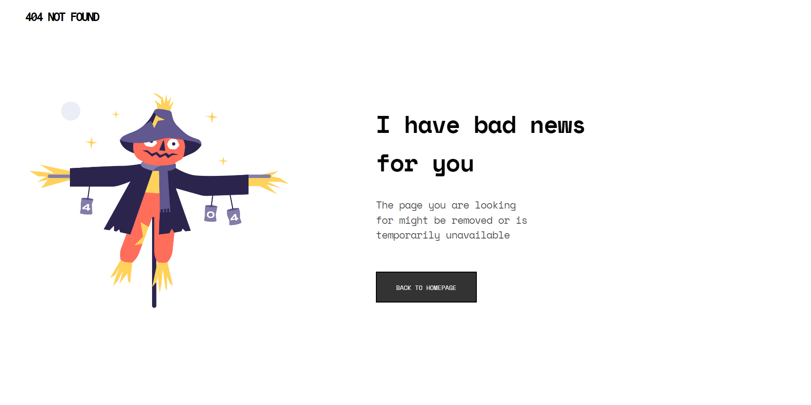

<!-- Please update value in the {}  -->

<h1 align="center">{Alexis' PagenotFound}</h1>

   Solution for a challenge from  <a href="http://devchallenges.io" target="_blank">Devchallenges.io</a>.

  <h3>
    <a href="https://{your-demo-link.your-domain}">
      Demo
    </a>
     | 
    <a href="https://{your-url-to-the-solution}">
      Solution
    </a>
     | 
    <a href="https://devchallenges.io/challenges/wBunSb7FPrIepJZAg0sY">
      Challenge
    </a>
  </h3>

<!-- TABLE OF CONTENTS -->

## Table of Contents

- [Overview](#overview)
- [Built With](#built-with)
- [Features](#features)
- [Contact](#contact)
- [Acknowledgements](#acknowledgements)

<!-- OVERVIEW -->

## Overview

Introduce your projects by taking a screenshot or a gif. Try to tell visitors a story about your project by answering:

- Where can I see your demo?
To be indicated soon
- What was your experience?
My experience so far working with CSS on this mini-project has been a good one for me. Well.. I love replicating designs so taking up this challenge was not a biggie. I'm almost done with this challenge. 
Feel free to review my code! I'd love to receive feedback.

NB: to be updated soon ):
- What have you learned/improved?
My understanding of flexbox and its properties.
- Your wisdom? :)
Hmmm, well... for now I have nothing in particular to share.

NB: This space will be updated with time

### Built With

<!-- This section should list any major frameworks that you built your project using. Here are a few examples.-->
This project will be built with HTML & CSS.

## Features

<!-- List the features of your application or follow the template. Don't share the figma file here :) -->

This application/site was created as a submission to a [DevChallenges](https://devchallenges.io/challenges) challenge. The [challenge](https://devchallenges.io/challenges/wBunSb7FPrIepJZAg0sY) was to build an application to complete the given user stories.

## Acknowledgements

<!-- This section should list any articles or add-ons/plugins that helps you to complete the project. This is optional but it will help you in the future. For exmpale -->

- [Steps to replicate a design with only HTML and CSS](https://devchallenges-blogs.web.app/how-to-replicate-design/)
- [Node.js](https://nodejs.org/)
- [Marked - a markdown parser](https://github.com/chjj/marked)

## Contact

- GitHub [@nadjeley](https://{github.com/nadjeley})

